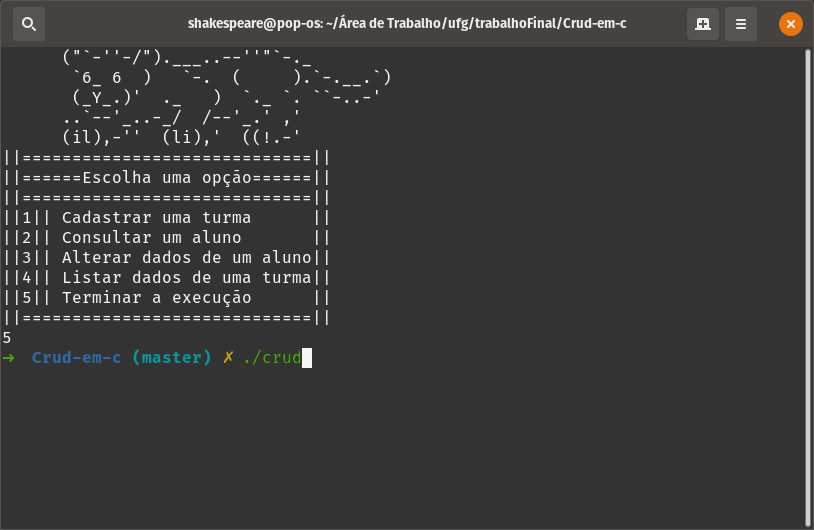

# Crud em C
### Um programa capaz de criar, atualizar, ler e ~~deletar~~ ler*Tudo* cadastro de alunos usando arquivos e struct
##### A função de deletar não está inclusa :( , mas para compensar o módulo 4 tem várias opções de leitura :)
#### Função 1,2,3 e 5 ok. Função 4 funcionando perfeitamente, falta organizar o código
#### Corrigido erro em que 3 listava após a alteração
#### Corrigido erro em que 4 duplicava o ultimo registo
#### Corrigido erro em que 4 ordennava somente se a primeira letra fosse maior
# Para compilar e executar:
##### Execute o comando "gcc -o crud crud.c -lm" no seu terminal para compilar
##### Execute "./crud" para executar
## Exemplo (o módulo 1 não consta no exemplo, pois seu uso é óbvio):

