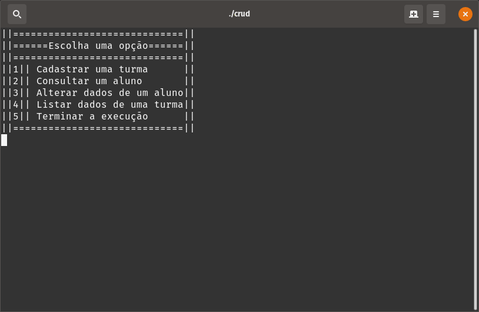

# Crud em C
### Um programa capaz de criar, atualizar, ler e deletar cadastro de alunos usando arquivos e struct 
#### Função 1,2,3 e 5 ok. Função 4 funcionando apenas o 4.1
#### Corrigido erro em que 3 listava após a alteração
#### Corrigido erro em que 4 duplicava o ultimo registo
# Para executar:
##### Execute o comando "gcc -o crud crud.c -lm" no seu terminal para compilar
##### Execute "./crud" para executar
## Exemplo (está na versão antiga, atualizado em breve):

